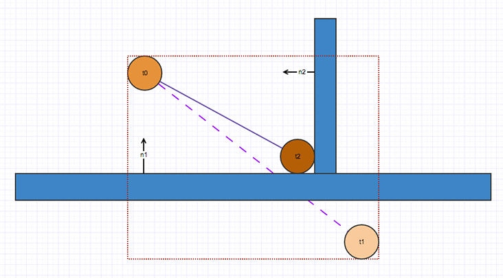
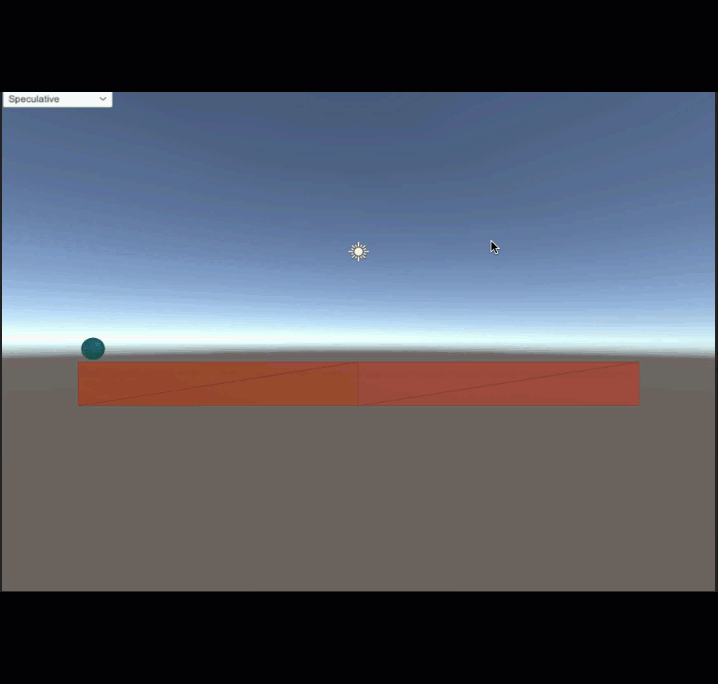

# 게임 알고리즘

## 공간 분할(Space Division)
공간 분할은 지형을 일정 크기로 나누어 카메라 시야 내에 들어오지 않는 오브젝트와 지형을 제외시키기 위해 사용한다. 이를 사용하면 모든 오브젝트를 렌더링 하는 것 보다 효율적으로 게임을 구현 할 수 있다.   
3D 데이터를 표현하기 위한 자료구조는 장면 그래프(Scene Graph)라고 부르며, 여기에는 트리 구조를 사용하고 노드가 공간을 가지고 있는 이진트리, 쿼드트리(QuadTree), 옥트리(Octree) 등을 사용한다.

### 쿼드 트리
공간을 재귀적인 호출을 사용해 4개의 자식 노드로 분할하는 방법이며 일반적으로 공중에 떠 있는 개념이 없는 지형(Terrain)에 사용된다.


2차원 공간을 4개의 동일한 공간으로 재귀적으로 세분화 해 분할하는 방법이다.   


지형의 크기가 매우 클 경우 사용하기 좋으며 카메라 시야에 잡히지 않는 큰 사분면들을 컬링하고 컬링되지 않은 사분면의 자식노드들을 사분할하여 이를 다시 수행해 반복한다.

#### 쿼드 트리 예시
[백준 1992번 문제](https://www.acmicpc.net/problem/1992)


맵이 모두 흰색(0)이거나 모두 검은색(1)이 아니므로 이를 4등분한다. 그 뒤 그림을 보면 2사분면은 모두 흰색이니 하나의 0으로 표현하고 4사분면은 모두 검은색이니 하나의 1로 표현한다.
그 후 남은 1사분면과 3사분면에 대해 다시 4등분하여 이를 반복한다.

```
쿼드 트리 클래스

    맵 행렬 선언

    받은 맵을 4분할 하는 함수

        행렬의 모든 요소가 동일한지 확인 함수
         비교값 = 행렬의 첫 요소
         (반복문)행렬을 순회하며 모든 값 비교
        (조건문) 모든 행렬의 요소가 같다면 true, 아니라면 false
            위 함수가 true 일때 그 행렬의 첫 요소를 반환하는 함수
            위 함수가 false 일때 
                받은 맵을 4분할 하는 함수
```

## 연속 충돌 검사(CCD)

연속 충돌 검사(CCD)는 빠르게 움직이는 바디가 오브젝트를 지나치거나 통과하지 않고 충돌하도록 하는 알고리즘으로, 유니티에선 스위핑 기반 CCD와 추측성 CCD 메서드를 제공한다.

### 스위핑 기반 CCD

스위핑 기반 CCD는 객체간의 충돌을 계산하는데 사용되는 충돌시점(TOI) 알고리즘을 사용한다. 오브젝트의 현재 속도를 기반으로 충돌 시점을 계산하고 이동 방향에서의 잠재적인 충돌을 감지해서 충돌 시간을 예측하고 이 시간까지 오브젝트를 이동 시킨다. 이 후 추가적으로 속도를 계산 하고 추가 스위핑을 수행 할 수 있다.

이 방법은 정확하게 충돌 시점을 예측할 수 있다는 장점이 있다.   
하지만 `리니어 스위핑`에 의존하여 바디의 각도 모션을 무시하므로 <!-- 이게 무슨 소리지? 충돌을 감지할 물체가 회전하는 경우같이 충돌 영역이 달라질 수 있는데 고려하지 않고 리니어 스위핑(직선 경로만 검사) 한다는 건가?-->  빠르게 회전하는 오브젝트는 오브젝트 터널링이 발생 할 수 있고 많은 오브젝트를 처리할 때 오버헤드가 발생하기 쉽다는 단점을 가지고 있다.

 <br>

막대가 너무 빠르게 회전해 두 객체간의 충돌 감지가 어려워 충돌을 감지 하기 전, 막대가 구체를 통과해 버리는 `오브젝트 터널링`이 발생 할 수 있다. <br>
<!-- 막대가 너무 빠르게 회전해서 충돌 영역이 달라지니까 막대와 구체의 충돌영역을 계산해야 하는데 직선 경로만을 검사해서 이미 통과한 판정이 나와버린건가? -->

### 추측성 CCD 

스위핑 기반 CCD와는 다르게, 오브젝트의 리니어와 각도 모션을 기반으로 오브젝트의 최소 경계 상자(AABB)를 확장하는 방식으로 작동한다. '추측성' CCD인 이유는 모든 잠재적인 충돌을 가져와 충돌 제약 조건을 해결해서 오브젝트가 충돌을 통과하지 않도록 하기 때문이다.

 *AABB : 3D 혹은 2D 공간에서 물체를 포함하는 가장 작은 박스, 너무 크거나 불완전할 경우 잘못된 충돌을 감지 할 가능성이 있다.*




위 그림은 t0에서의 구체가 경로에 벽이 없다면 t1 포지션에 도달 할 수 있는 경우를 나타낸다. 추측성 알고리즘은 AABA를 n1과 n2 를 포함하는 2개의 컨택트를 가져와 구체가 벽면을 통과하지 않도록 유지하는것을 요청한다.   <!-- 이부분에 대한 추가설명을 찾지 못했다. 잘 이해가 가지 않음-->

반복적인 스위핑이 필요하지 않고, 한번의 검사로 충돌 가능성을 모두 검사하므로 리소스 소모가 스위핑 기반 알고리즘에 비해 상대적으로 적다.

 <br>

추측성  CCD가 활성환된 막대 오브젝트. 회전하는 과정에서 구체와 접촉해 충돌이 발생한다. <!-- 프레임단위로 뜯어봤는데 충돌이 안일어난다.. 충돌판정이 보이는것보다 큰가..? 뒤의 고스트 충돌을 말한거라면 이해가 되긴 하지만 -->

다만 추측성 CCD의 경우 모든 잠재적 접촉을 수집하기 때문에 정확도가 감소해, 실제로 충돌이 발생하지 않는 상황에서 잘못된 충돌을 감지하는 고스트 충돌이 발생할 가능성이 있다. 그래서 속도가 빠른 오브젝트가 충돌 부분을 따라 미끄러져 튀어나오는 문제가 발생 할 수 있다.

 <br>

다음 그림에서 구체가 t0부터 오른쪽으로 수평 이동할 때, 예측 포지션은 t1이나 팽창된 AABB가 b0, b1 상자와 겹치게 되고 CCD는  c0과 c1에 추측성 충돌을 도출한다. <!-- 여기서부터 이해도 애매함--> 추측성 CCD는 충돌을 도출해 c0은 경사진 경계가 되어 t0은 경사면을 따라 튀어올라 t1으로 진행하지 않고 t1`이 된다.


c0에서 발생한 고스트 충돌으로 인해 직선으로 가야할 구체가 위로 튀어오르는 모습<br><br>


또한 추측성 CCD도 터널링이 발생할 수 있는데 이는 충돌 검사 단계동안만 계산되기 때문이다.


t0 구체는 t1 방향으로 움직이고, b0 막대가 시계방향으로 회전한다. 그러다 구체가 t1`에 도달하고 막대가 회전하다 b1의 위치가 되어 구체와 막대가 충돌할 때, 구체가 충돌에서 과도한 에너지를 받았다면 AABB 내부에서 이탈하게 되고   
튕겨난 구체는 파란색 막대와 충돌해야 하지만 AABB의 내에서만 접촉을 계산해 충돌검사가 수행될 수 있기 때문에 파란색 막대와 구체는 충돌검사가 수행되지 않아 구체는 막대를 통과하는 터널링 현상이 발생 할 수 있다.

### 결론
CCD는 유니티에서 충돌을 감지하기 위한 알고리즘이며 물리적인 충돌과 상호작용을 도울 수 있지만, 사용 방식에 따라 오버헤드 및 고스트 충돌 등의 문제가 발생 할 수 있으므로 사용시 적절한 상황인지 고려해야 한다.