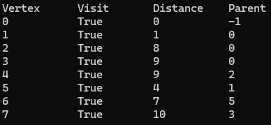

# 최단 경로 알고리즘

## 다익스트라 알고리즘(Dijkstra Algorithm)
특정한 노드에서 출발해 다른 노드로 가는 각각의 최단 경로를 구함
방문하지 않은 노드 중 최단 거리가 가장 짧은 노드를 선택하고 해당 노드를 거쳐 다른 노드로 가는 비용을 계산한다.

### 구현 및 설명
```c#
 public static void Dijkstra(int[,] graph, int start, out bool[] visited, out int[] distance, out int[] parent)
 {
     int size = graph.GetLength(0); // size : 그래프의 정점 개수
     visited = new bool[size]; // visited : 각 정점의 탐색 여부
     distance = new int[size]; // distance : 각 정점의 최단거리
     parent = new int[size]; // 각 정점을 탐색한 정점이 누구인지 (역순으로 해보면 경로)

     for (int i = 0; i < size; i++) // 초기화
     {
         visited[i] = false; // 방문하지 않은 상황부터 시작
         distance[i] = INF;  // 아직 거리를 재지 않음
         parent[i] = -1; // 탐색한 정점이 아직 없다
     }
     distance[start] = 0;

     for (int i = 0; i < size; i++)
     {
         // 1. 가장 가까운 정점부터 선택
         int minIndex = -1; // minIndex : 가장 작은 거리를 가진 위치를 기록해두기 위한 변수
         int minCost = INF; // minCost : 가장 작은 거리 수치를 기록해두기 위한 변수
         for (int j = 0; j < size; j++)
         {
             {
                 if (visited[j] == false && // 탐색한 적이 없는 정점
                     distance[j] < minCost) // 거리가 가장 작은 정점
                 {
                     // 더 작은 거리를 찾았으면
                     minIndex = j;           // 가장 작은 거리를 찾은 위치
                     minCost = distance[j];  // 가장 작은 거리의 수치 
                 }
             }
         }
         if (minIndex < 0) // 연결되어 있으면서 탐색한적이 없는 정점이 없었던경우
             break;        // 돌릴 필요 없음 탐색종료


         visited[minIndex] = true; // 가장 거리가 작은 정점을 찾았다는 표시 // 다음으로 찾을 정점은 탐색했다고 표시

         // 2. 선택한 정점을 거쳐서 더 짧아지는 경우 갱신
         for (int j = 0; j < size; j++)
         {
             // distance[j] : 목적지까지 직접 연결된 거리
             // distance[minIndex] : 선택한 정점까지의 거리
             // graph[minIndex, j] : 선택한 정점에서 목적지까지의 거리

             // 목적지까지 직접 연결된 거리가 거쳐가 가는 거리보다 더 큰 경우
             if (distance[j] > distance[minIndex] + graph[minIndex, j])
             {
                 //목적지 까지 직접 가는 거리를 거쳐서 가는 거리로 바꿔줌
                 distance[j] = distance[minIndex] + graph[minIndex, j]; 
                 parent[j] = minIndex; // 탐색한 정점을 변경
             }
         }
     }
 }
// 다익스트라 알고리즘 표 출력
 private static void PrintDijkstra(bool[] visited, int[] distance, int[] parents)
 {
     Console.WriteLine($"{"Vertex",-12}{"Visit",-12}{"Distance",-12}{"Parent",-12}");

     for (int i = 0; i < visited.Length; i++)
     {
         Console.Write($"{i,-12}");

         Console.Write($"{visited[i],-12}");

         if (distance[i] >= INF)
         {
             Console.Write($"{"INF",-12}");
         }
         else
         {
             Console.Write($"{distance[i],-12}");
         }

         Console.WriteLine($"{parents[i],-12}");
     }
 }
```
### 예시 그래프 및 결과
```c#
        static void Main(string[] args)
        {
            int[,] graph = new int[8, 8] // 예시 그래프
            {   // 0   1    2    3     4    5    6    7    
                {   0,   1,   8,   9, INF, INF, INF, INF, },
                {   1,   0, INF, INF, INF,   3, INF, INF, },
                {   8, INF,   0, INF,   1, INF,   3, INF, },
                {   9, INF, INF,   0, INF,   9, INF,   1, },
                { INF, INF,   1, INF,   0, INF,   9, INF, },
                { INF,   3, INF,   9, INF,   0,   3, INF, },
                { INF, INF,   3, INF,   9,   3,   0,   9, },
                { INF, INF, INF,   1, INF, INF,   9,   0, }                
            };

            Dijkstra(graph, 0, out bool[] visited, out int[] distance, out int[] parents);
            PrintDijkstra(visited, distance, parents);
        }
```
 <br>

