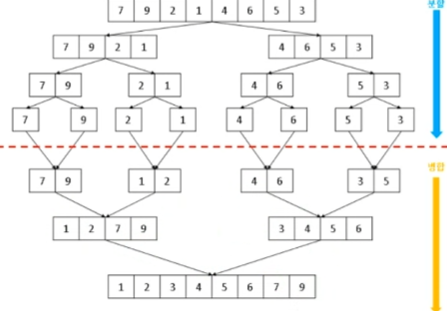

## 정렬 알고리즘

[정렬 알고리즘 애니메이션 웹페이지](https://www.cs.usfca.edu/~galles/visualization/ComparisonSort.html)


특정 배열이나 콜렉션을 넘겨 이를 오름차순이나 내림차순으로 정렬시키는 알고리즘

### 버블정렬 (Bubble Sort)
시간복잡도 : O(n^2)<br>
인접한 두개를 비교해서 작으면 앞으로 가져오고 반복함   
연결리스트 정렬을 할 때 유용함.


```c#
public static void BubbleSort(int[] arr)
{
    int n = arr.Length;

    for (int i = 0; i < n - 1; i++)
    {
        for (int j = 0; j < n - i - 1; j++)
        {
            if (arr[j] > arr[j + 1])
            {
                int temp = arr[j];
                arr[j] = arr[j + 1];
                arr[j + 1] = temp;
            }
        }
    }
}
```

### 선택 정렬(Selection Sort)
시간복잡도 : O(n^2)   
간단한 정렬 알고리즘으로, 리스트에서 최소값을 선택해 정렬되지 않은 부분과 정렬된 부분을 나누어, 정렬되지 않은 부분에서 최소값을 선택하여 정렬된 부분에 추가한다.

```c#
public static void SelectionSort(int[] arr)
{
    int n = arr.Length;

    for (int i = 0; i < n - 1; i++) //(int i=0; i<array.Length; i++)
    {
        int minIndex = i;
        for (int j = i + 1; j < n; j++) // (int j; j<array.length, j++)
        {
            if (arr[j] < arr[minIndex])
                minIndex = j; //가장 작은값의 위치
        }

        int temp = arr[i];
        arr[i] = arr[minIndex];
        arr[minIndex] = temp;
    }
}
```

### 삽입 정렬(Insertion Sort) 
시간복잡도 : O(n^2)   
리스트를 정렬된 부분과 정렬되지 않은 부분으로 나눈 후, 정렬되지 않은 부분의 원소를 정렬된 부분의 적절한 위치에 삽입하는 과정을 수행하여 정렬한다.   
연결리스트 정렬은 불가하다.
<!-- 마치 역 버블 정렬처럼 보임-->
```c#
public static void InsertionSort(int[] arr)
{
    int n = arr.Length;

    for (int i = 1; i < n; i++)
    {
        int key = arr[i];
        int j = i - 1;

        while (j >= 0 && arr[j] > key)
        {
            arr[j + 1] = arr[j];
            j--;
        }

        arr[j + 1] = key;
    }
}
```

### 퀵 정렬(Quick Sort)
시간복잡도 : 평균(n log n), 최악 O(n^2)   
공간복잡도 : O(1)   
`분할` 정복 기법을 사용하는 정렬 알고리즘, 리스트를 `기준값`을 중심으로 분할 후 재귀적으로 정렬한다.   
하나의 피벗을 기준으로 작은값과 큰값을 2분할하여 정렬함   
불안정 정렬(앞과 뒤가 바뀔 수 있음)


#### 불안정정렬과 안정정렬

- 안정 정렬 : 반복되는 요소를 입력 떄와 동일한 순서로 정렬 
    - 기존의 다른 요소를 기준으로 정렬된 자료를 넣었을 때 재사용성이 높아짐
- 불안정 정렬 : 반복되는 요소를 입력 때와 동일한 순서로 정렬을 보장하지 않음   
<br>


<!--기준값을 두고 기준값보다 작으면 앞에 큰건 뒤에 넣는다.-->
```c#
public static void QuickSort(int[] array, int start, int end)
{
    int pivot = start; // 가장 처음 요소를 기준으로 선정
    int left = pivot + 1; // 큰값을 오른쪽으로 보내는, 왼쪽부터 출발할 위치
    int right = end; // 작은값을 왼쪽으로 보내는, 오른쪽부터 출발할 위치

    while (left <= right)
    {
        while (array[left] <= array[pivot] && left < right)
        {   //left는 더 큰 값을 찾을때까지 오른쪽으로 가기(right 넘어 갈 필요 없음)
            left++;
        }
        while (array[right] > array[pivot] && left <= right)
        {   //right는 더 작은 값을 찾을때까지 왼쪽으로 가기 (left 넘어 갈 필요 없음)
            right--;
        }
        //아직 교차 전이면
        if (left < right)
        {   // 작은 값이랑 큰값이랑 서로 교체해서 왼쪽엔 작은값, 오른쪽엔 큰 값 두기
            int temp = array[left];
            array[left] = array[right];
            array[right] = temp;
        }
        else //교차를 했다면 => 반절로 나뉜 상황
        {   
            //기준을 중간으로 옮기는 과정
            int tmep = array[right];
            array[right] = array[pivot];
            array[pivot] = tmep;
            break;
        }
    }
    // 피벗을 기준으로 왼쪽부분은 작은값들, 오른쪽 부분은 큰값들이 모여있게됨
    QuickSort(array, start, right - 1);
    QuickSort(array, right + 1, end);
}
```


### 병합 정렬
시간 복잡도 : O(n long n) , 최악의 경우에도 같음   
공간 복잡도 : O(n)  
데이터를 2분할하여 정렬 후 병합   
데이터 갯수만큼의 추가적인 메모리 필요   
분할 정복 기법을 사용하는 알고리즘, 리스트를 반으로 나눈 후 재귀적으로 정렬 후 정렬된 부분 리스트를 병합해 최정 정렬을 수행함

 <br>
병합배열끼리 붙일때 맨 앞 요소만 비교해도 됨(그 뒤는 어차피 맨 앞요소 보다 클 테니)   
그 후 가장 작은요소를 맨 앞에 두고 그것을 뺀 두 배열을 다시 비교 반복한다.   
즉 병합할때 정렬된 배열을 둘 별도의 공간이 필요함   
안정 정렬(앞과 뒤가 바뀌지 않음) : 재사용성이 좋음
```c#
//병합정렬
public static void MergeSort(int[] array, int start, int end)
{
    if (start == end)
        return;
    int mid = (start + end) / 2;
    MergeSort(array, start, mid);
    MergeSort(array, mid + 1, end);
    Merge(array, start, mid, end);
}

public static void Merge(int[] array, int start, int mid, int end)
{
    List<int> sortedList = new List<int>();
    int leftIndex = start;
    int rightIndex = mid + 1;

    // 왼쪽 배열과 오른쪽 배열 중 하나라도 모두 소진될때까지
    while (leftIndex <= mid && rightIndex <= end)
    {
        //왼쪽 배열의 요소가 더 작을 경우
        if(array[leftIndex] < array[rightIndex])
        {
            // 추가 메모리공간에 왼쪽 요소 추가하고 인덱스 한칸 이동
            sortedList.Add(leftIndex);
            leftIndex++;
        }
        //오른쪽 배열의 요소가 더 작을 경우
        else
        {
            //추가 메모리공간에 오른쪽 요소 추가하고 인덱스 한칸 이동
            sortedList.Add((int)array[rightIndex]);
            rightIndex++;
        }
    }
    // 남아 있는 배열을 모두 나머지 뒷쪽으로 붙이기
    if(leftIndex > mid) // 왼쪽 배열이 모두 소진됐을 때
    {
        while(rightIndex <= end)
        {
            sortedList.Add(array[rightIndex]);
            rightIndex++;
        }                
    }
    else // 오른쪽 배열이 모두 소진됐을 때
    {
        while(leftIndex <= mid)
        {
            sortedList.Add(array[leftIndex]);
            leftIndex++;
        }
    }

    //추가적인 메모리에 정렬 시켜두었던 것을 다시 원래 배열에다 교체
    for (int i = 0; i < sortedList.Count; i++)
    {
        array[start + i] = sortedList[i];
    }
}
```

### 힙 정렬
힙을 이용해 우선순위가 가장 높은 요소가 가장 마지막 요소와 교체된 후 제거되는 방법을 사용   
배열에서 연속적인 데이터를 사용하지 않기 때문에 캐시메모리를 사용할 수 없어 상대적으로 느림   
불안정 정렬

### 인트로 정렬
항상 효율적인 정렬 방법은 없다.  
쪼개다 요소가 16개 이하일 경우 쪼개는 것 보다 바로 정렬하는게 더 빠름
1. 리스트의 크기가 16 이하라면 삽입 정렬을 한다.
2. 전체 리스트에 대해 퀵 정렬을 수행한다