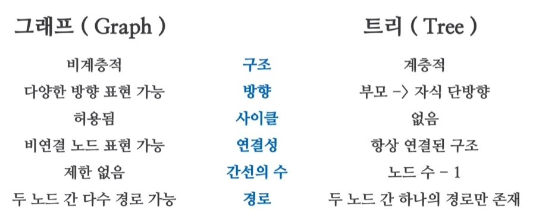

# 비선형 자료구조

- 데이터간의 관계도를 표현하기 위한 자료구조
- 대표적으로 그래프와 트리가 있다.

## 그래프(Graph)

1. 데이터 간의 다양한 연결관계를 표현함
2. 정점과 이들을 연결하는 간선으로 구성
3. 간선에는 가중치 혹은 방향이 포함될 수 있음
4. 반드시 모든 정점이 간선으로 연결되어야 하는것은 아님
5. 한 노드에서 출발하여 다시 자기 자신의 노드로 돌아오는 순환 구조를 가질수도, 가지지 않을수도 있음.

### 인접 행렬 그래프
- 그래프 내의 각 정점의 인접관계를 나타내는 행렬
- 2차원 배열을 [출발정점과 도착정점]으로 표현
- 장점 : 인접여부 접근이 빠르다. O(1)
- 단점 : 메모리 사용량이 많다. O(n^2)
- 정점 개수가 많지 않을때 사용하기 편리함  

#### 양방향 연결 그래프
```c#
bool[,] matrixGraph1 = new bool[5, 5]
{
    //각 정점이 연결되어 있는지 true, false로 구현
    { false, false, false, false,  true },
    { false, false,  true, false, false },
    { false,  true, false,  true, false },
    { false, false,  true, false,  true },
    {  true, false, false,  true, false },
};

bool connect = matrixGraph1[2,1]
```

#### 양방향 가중치 그래프
```c#
const int INF = 99999; //단절은 최대값으로 표현
int[,] matrixGraph2 = new int[5, 5]
{
    {   0, 132, INF, INF,  16 },
    {  12,   0, INF, INF, INF },
    { INF,  38,   0, INF, INF },
    { INF,  12, INF,   0,  54 },
    { INF, INF, INF, INF,   0 },
};

static void Main()
{
    // 가중치에 따른 거리 접근
    int distance = matrixGraph2[0,2];
}
```

### 인접리스트 그래프
- 그래프 내의 각 정점의 인접 관계를 표현하는 그래프
- 인접한 간선만을 리스트에 추가하여 관리
- 장점 : 메모리 사용량이 적음 - O(n)
- 단점 : 인접여부를 확인하기 위해 리스트 탐색이 필요함 - O(n)

```c#
public void CreateGraph()
{
    listGraph1 = new List<int>[5];
    // 연결 추가
    listGraph1[0].Add(1);
    listGraph1[1].Add(0);
    listGraph1[1].Add(3);
    
    //연결 제거
    listGraph[0].Remove(1); 

    //연결 확인
    listGraph[0].Contains(1);


}
```
```c#

```

## 트리(Tree)

1. 데이터 간의 계층 구조를 정의하는 자료구조로 그래프의 일종
2. 각 노드는 하나의 부모 노드를 가진다 (1 대 다 구조)
3. 루트 노드에서 시작해 리프 노드로 이어진다
4. 모든 노드가 전부 연결되어 있다
5. 한 노드에서 출발하여 다시 자기 자신의 노드로 돌아오는 순환구조를 가지지 않음.


### 트리의 구성

- 부모(Parent) : 루트 노드 방향으로 직접 연결된 노드
- 자식(Child)  : 루트 노드 반대방향으로 직접 연결된 노드     
  
- 뿌리(root)   : 부모노드가 없는 최상위 노드, 트리의 깊이 0에 하나만 존재
- 가지(Branch) : 부모노드와 자식노드가 모두 있는 노드, 트리의 중간에 존재
- 잎(Leaf)     : 자식노드가 없는 노드, 트리의 끝에 존재

- 길이(Length) : 출발 노드에서 도착 노드까지 거치는 수
- 깊이(Depth)  : 루트 노드부터의 길이
- 차수(Degree) : 자식노드의 갯수

### 트리의 구현
노드를 기반으로 부모노드와 자식 노드를 보관할 수 있도록 구성된다.
자식노드들의 최대 갯수가 정해져 있는 경우 배열로, 정해지지 않은 경우 리스트로 구현한다.
```c#
public class TreeNode<T>
    {
        public T item;
        public TreeNode<T> parent;
        public List<TreeNode<T>> children;
    }
```

### 그래프와 트리의 차이점


