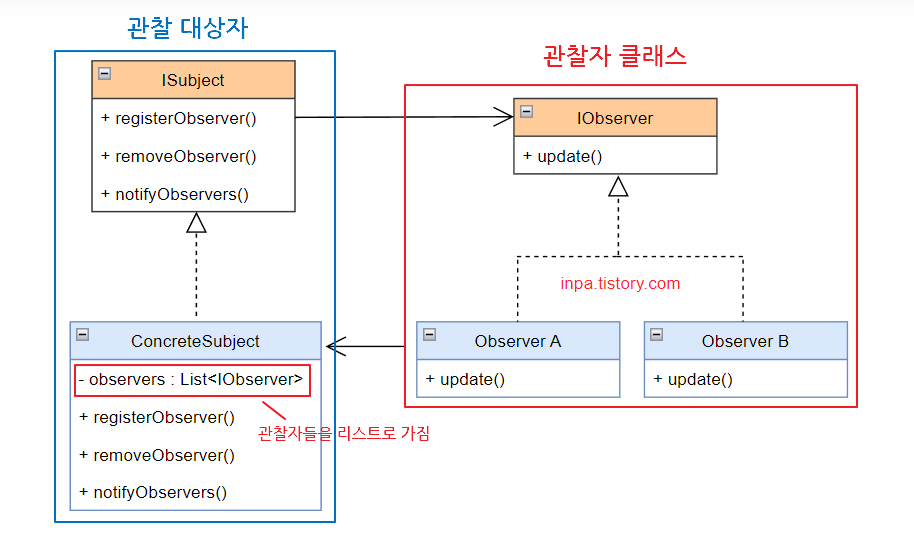

# 옵저버 패턴(Observer Pattern)

### 옵저버 패턴이란
객체의 상태 변화를 `관찰`하는 옵저버들의 목록을 객체에 등록해서 변화가 있을 떄 객체가 직접 옵저버에게 `통지`하도록 하는 디자인 패턴이다. 
옵저버 패턴은 `Observer`와 `Subject` 두 종류로 나뉘며  Observer는 Subject의 상태 변화를 관찰하며 Subject는 Observer에게 상태의 변화를 알리는 개체이다.  

> 옵저버 패턴의 관찰은 갱신을 위한 정보를 `전달`받기를 기다리는 상태이다. 능동적으로 대상을 관찰하는것이 아닌, 수동적으로 전달받기를 기다리는 상태

## 옵저버 패턴의 특징

 
- Subject가 변경 될 때마다 Observer 들에게 변화를 알려주는 디자인 패턴이다.
- Subject의 상태가 바뀌면(Event가 발생하면) Subject를 관찰하던 Observer들의 내용이 갱신이 되는 `일대다(one-to-many) 의존방식`이다.
- Observer는 추가와 제거가 용이하다.
- Subject나 Observer가 달라져도 서로에 영향이 없다.
  
## 옵저버 패턴의 장단점

### 장점 
- Subject의 상태 변경을 매번 요청하는 것이 아니라 Event를 통해 자동으로 감지 할 수 있다.
- Subject의 코드 변경 없이 Observer의 추가와 제거가 용이하기 때문에 계방 폐쇄 원칙을 준수한다.
- 느슨한 결합으로 

### 단점
- Observer들은 Event의 알림 순서를 제어할 수 없고 무작위 순서로 알림을 받는다.
- 너무 많이 구성하면 구조와 동작을 알아보기 힘들다
- 객체를 등록 이후 해지하지 않는다면 메모리 누수가 발생 할 수 있다.