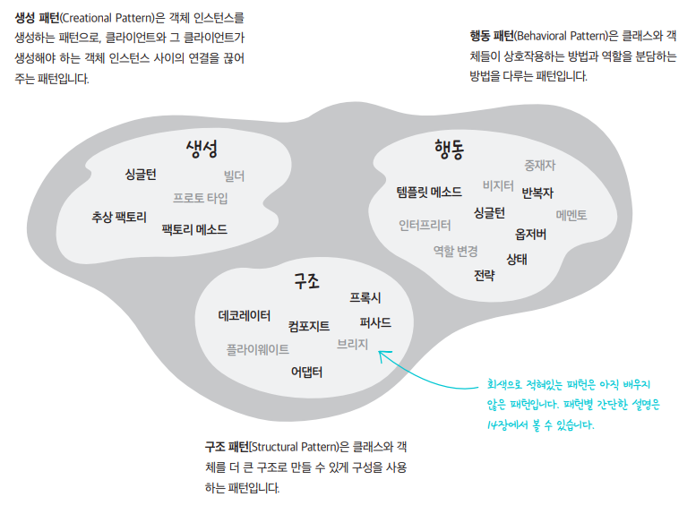

# GoF 

GoF란 객체지향에서 사용하는 23개의 패턴의 집합이며 
이러한 디자인 패턴은 목적과 범위에 따라 분류 할 수 있다. 목적에 따라 분류하면 생성과 구조, 행위의 세 범위로 나뉘며 범위에 따라 분류하면 클래스와 객체의 범위로 나눌 수 있다.

## 생성 패턴

객체의 생성과 관련한 패턴의 집합으로, 클라이언트와 클라이언트가 생성해야 하는 객체 인스턴스 사이의 연결을 끊어주는 패턴이다. 객체의 생성 과정과 참조 과정을 캡슐화 및 추상화 하여 유연성 및 재사용성을 높일 수 있다.

### 팩토리 메서드
객체의 생성을 서브 클래스로 위임하여 캡슐화 하는 디자인 패턴이다   
 상속을 통해서만 인스턴스를 생산하면, 유형별로 클래스가 많이 생기며 각각의 클래스마다 가져야하는 값이나 구현방법을 찾아야만 한다. 혹은 다형성 확보를 통해 생성하는 경우엔 매 생성마다 각각의 필드를 지정해 주어야하는데 다른 값을 집어넣어 상이한 데이터를 가지는 같은 유형의 객체를 만들어야 하는경우 불편함을 야기한다. 이 경우 팩토리 패턴을 이용한다면 인스턴스 생성을 메서드를 활용해 객체를 만들 수 있어 편리하다.

 - 같은 클래스에 다른 유형의 인스턴스를 만들 때 유용함
 - 생성 과정을 팩토리에서만 관리하기 때문에 단일책임 원칙을 준수한다.
 - 계방폐쇄원칙을 준수한다.

### 빌더 

복합 객체의 생성과 표현을 분리해 동일한 생성 절차에서도 다른 표현 결과를 만들어 낼 수 있는 디자인 패턴으로 자신의 클래스에서 객체 생성 코드를 추출해 빌더라는 별도의 객체들로 이동하도록 한다.
객체를 생성할 때 빌더 객체를 실행해 모든 단계를 호출 할 필요 없이 객체의 특정 설정을 제작하는데 필요한 단게만을 호출 할 수있다.

***팩토리 패턴과 빌더의 차이점***

팩토리 메서드 패턴은 객체 생성을 위한 인터페이스를 정의하고, 객체 생성을 서브 클래스에 위임하는 패턴이다.  
- 팩토리는 제품 표가 있어 미리 생산될 제품이 준비 된 경우
이에 비해 빌더 패턴은 객체 생성 과정을 다루는 패턴으로, 객체 생성을 단계적으로 수행한다    
- 빌더의 경우 뼈대가 있는 상황에서 여러 요소를 붙여줄 수 있는 경우

### 추상 팩토리 

구체적인 클래스를 지정하지 않고 인터페이스를 통해 서로 연관되는 객체들을 그룹으로 표현하는 디자인 패턴이다. 
게임의 캐릭터 생성이나 인터페이스 등을 구현하려 할 경우 사용 할 수 있다.

### 프로토 타입

원본 객체를 복사함으로써 새로운 객체를 생성하는 디자인 패턴이며 객체의 복사본을 효율적으로 만들 수 있다. 
게임의 캐릭터나 몬스터 npc 등의 객체를 복제할 때 효율적이다.

### 싱글톤

어떤 클래스의 인스턴스는 하나임을 보장하고 해당 객체를 어디서든 참조할 수 있도록 하는 패턴으로 객체가 가지는 자원을 공유할때 유용하다.
게임의 세이브 데이터나 설정등을 관리할 때 유용할 수 있다.

## 구조 패턴

구조패턴은 클래스의 복잡한 구조를 간단하게 만들거나 더 큰 구조로 만들 수 있게 하는 패턴이다.

### 어댑터

클래스의 인터페이스를 다른 인터페이스로 변환해 다른 클래스가 이용할 수 있도록 함
모바일 pc 콘솔 등 멀티 플랫폼 게임을 지원할 때 유용하다.

### 브리지 

구현부에서 추상층을 분리해 각자 독립적으로 확장할 수 있게 함 //설명만 들어선 잘 모르겠다
추상화와 구현을 따로 분리하면 복잡한 시스템을 더 유연하게 관리 할 수 있다 (?)

### 컴포지트 

객체들의 관계를 트리 구조로 구성해 복합 객체와 단일 객체를 구분없이 다루는 디자인 패턴으로 두 경우를 동일한 방식으로 다룰 수 있게 한다. 
런타임 시점에 어떤 방식으로 기능을 구현 할지 선택할 수 있으며, 기능을 독립적으로 확장 할 수 있다면 상세한 기능을 외부로부터 숨길 수 있는 은닉효과를 누릴 수 있다.

### 데코레이터

주어진 상황 및 용도에 따라 어떤 객체에서 다른 객체를 덧붙이는 방식으로 추가적인 기능을 동적으로 추가할 수 있다.
객체의 구조를 변경하지 않고 새로운 기능을 조립 할 수 있다.    
// 빌더패턴과 유사하네? 데코레이터는 이미 생성된 객체에 기능을 추가하는거고 빌더는 생성 전에 관여한다는 차이인가?   

게임의 UI를 추가하거나 게임의 새로운 상태이상을 추가할때 유용하다.

### 퍼싸드 

서브시스템에 있는 인터페이스 집합에 대해 하나의 통합된 인터페이스를 제공하며 복잡한 시스템에 대한 간단한 인터페이스를 제공한다. // 추상화? 캡슐화?

### 플라이웨이트

크기가 작은 여러개의 객체를 매번 생성하지 않고 가능한 공유 할 수 있도록 해 메모리를 절약함
옛날 슈퍼마리오 게임에서 구름과 풀을 같은 소스를 썼다는것이 예시가 될 수 있을까?

### 프록시

접근이 어려운 객체로의 접근을 제어하기 위해 객체의 Surrogate나 Placeholder를 제공함   
사이즈가 큰 객체가 로딩되기 전 프록시를 통해 참조할 수 있다.

## 행위 패턴
객체들의 상호작용하는 방법이나 책임을 분배하는 패턴으로 객체나 클래스의 교류 방법을 정의한다. 여러 객체를 분배하며 그들간의 결합도를 최소화 할 수 있도록 도와준다.

### 책임 연쇄

요청을 받는 객체를 연쇄적으로 묶어 요청을 처리하는 객체를 만날 때 까지 객체 체인을 따라 요청을 전달함<!-- 하청업체? -->
격투게임에서 커맨드 유예 안에서 입력된 커맨드를 입력 유예시간 동안 단순 입력을 받아 계속 넘겨 조합된 커맨드로 완성시키고  해당 커맨드를 조합해서 기술로 입력되는 판정으로 만들 수 있다.

### 커맨드

요청을 객체의 형태로 캡슐화해 재사용하거나 취소할 수 있도록 저장함   
문서나 특정 작업시 뒤로 돌리는 컨트롤+z 키가 이것으로 구현되었지 않을까 싶다.

### 인터프리터

특정 언어의 문법 표현을 정의하는 패턴으로 문법의 규칙을 수정하거나 추가할 때 유용하며 컴파일러를 구현할때도 사용된다.
새롭고 이상한 컴퓨터 언어를 만들거나 단순히 계산기를 만들때도 활용 될 수 있다.

### 반복자

내부를 노출하지 않고 접근이 잦은 어떤 객체의 원소를 순회할 수 있도록 하는 디자인 패턴이다.
내부의 복잡성을 외부에 숨기고 싶을 때 은닉을 목표로 사용하면 좋다.

### 중재자

한 집합체에 속해있는 객체들의 상호작용을 캡슐화해 새로운 객체로 정의하는 디자인패턴으로 혼란스로운 의존관계들을 줄일 수 있다.
FPS게임에서 서버가 유저들의 총을 쏜 행동을 받아 피격판정을 줄 수 있다. 대신 중재의 딜레이가 있어 핑 문제가 생길 수 있다 <!-- 이게 맞나?-->

### 메멘토

객체가 특정 상태로 다시 되돌아 올 수 있도록 내부상태의 이전상태를 저장하고 복원할 수 있게 해주는 디자인 패턴이다. 게임의 임시 저장상태에 다시 불러올 수 있게 하는 기능에 쓰일 수 있다.

### 옵저버

객체의 상태가 변화할 때 관련 객체들이 그 변화를 통지받고 자동으로 갱신될 수 있게 함   
서브젝트와 옵저버로 나뉘며 서브젝트를 옵저버가 구독하는 관계로 유튜브 영상 구독같은곳에 쓸 수 있다.

### 상태

내부 상태가 변경될 때 해당 객체가 그의 행동을 변경할 수 있도록 하는 디자인 패턴으로 상태에 따라 동작을 다르게 할 수 있어 상태전환을 쉽게 관리 할 수 있다.
캐릭터의 피격과 부상, 사망에 따른 상태에 따라 다른 행동을 할 수 있게 해준다.
//이벤트와 비슷한 역할이나 좀 다름, 상태 패턴은 객체의 행동을 변경하는것

### 전략

알고리즘의 패밀리를 정의하고 각 패밀리를 별도의 클래스에 넣은 후 객체들을 상호 교환할 수 있도록 하는 패턴이다. 상대에 따라 전략을 교체하듯 전략 객체를 사용해 작업을 교체하고 알고리즘을 교체 할 수 있다.

### 템플릿 메서드

보무 클래스에서 알고리즘의 골격만 정의하고 알고리즘의 구조를 변경하지 않으면서 자식들이 오버라이드 할 수 있게 하는 디자인 패턴이다.   
알고리즘 판 팩토리 메서드라고 보면 비슷하다. 팩토리 메서드는 객체 생성을 서브클래스에서 구현하고, 템플릿 메서드는 알고리즘 중 오버라이딩 할 단계를 서브클래스에서 구현 할 수 있다.

### 비지터

비지터 패턴은 알고리즘을 작동하는 객체들로부터 분리 할 수 있도록 하는 디자인 패턴이다.   
객체 구조를 변경하지 않고 새로운 기능을 추가 할 수 있지만 추가된다면 모든 비지터 인터페이스를 수정해야할 가능성이 있다.
충돌감지에 쓰인다고 한다. 여러 도형을 기준으로 한 충돌 감지 연산을 추가할때 용이할 수 있을것이다.
