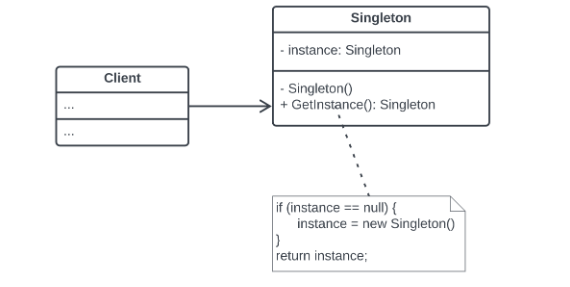

# 디자인 패턴

## 디자인 패턴이란
디자인 패턴은 객체 지향 프로그래밍 설계를 할 때 반복적으로 발생하는 문제들에 대한 일반적이고 재사용 가능한 해결책을 제공하는 패턴이다. 바퀴를 다시 발명하지 않는 접근법을 제공하고 검증된 설계 경험을 공유한다.

## 왜 배워야 하는가
디자인 패턴은 소프트웨어 디자인에서 자주 마주치는 문제들에 대한 검증된 해결 방법을 제시해준다. 이러한 패턴을 익히고 적용해서 초보 개발자들도 광범위한 문제들을 직접 경험하지 않고도 빠르게 숙련된 개발자가 될 수 있다. 또한 디자인 패턴은 개발 과정을 가속화하고 유지보수를 용이하게 하며 더 신뢰할 수 있는 시스템을 구축하는데 필수적인 역할을 한다. 이로 인해 소프트웨어 개발 과정에서 발생하는 오류를 줄일 수 있다. 주요 장점으로 다섯가지가 있다.
- 코드 재사용성 향상
- 유지보수 용이성
- 팀 커뮤니케이션 개선
- 효과적인 문제 해결
- 장기적인 시스템 안정성

## 디자인 패턴의 핵심요소
- 패턴 이름(Name) : 각 패턴은 특정한 문제 해결 방법을 설명하는 고유한 이름을 가진다. 이름은 커뮤니케이션을 쉽게 하고, 개념을 명확히 한다.
- 문제(Problem) : 패턴이 해결하려는 특정 상황 또는 문제를 설명한다.
- 해결책(Solution) : 문제를 해결하기 위한 설계와 전략을 제시한다. 구체적인 코드가 아닌 추상적인 설명으로, 다양한 상황에 적용할 수 있다.
- 결과(Result) : 패턴 사용의 결과. 이점 및 잠재적인 단점을 포함한다.

## 디자인 패턴의 기본 원칙(객체 지향 설계 원칙)
디자인 패턴은 객체 지향 프로그래밍의 원칙에 뿌리를 두며 이는 패턴의 효과적인 적용과 이해를 위한 기초를 제공한다.
객체 지향의 다섯가지 설계 원칙이 있다.
- 단일 책임 원칙 : 각 클래스는 하나의 기능 또는 책임만을 가져야한다. 이는 코드의 복잡성을 줄이고 유지보수를 용이하게 한다.
- 개방 폐쇄 원칙 : 소프트웨어 엔티티는 확장에는 열려있어야 하지만 수정에는 닫혀있어야한다. 기존 코드를 변경하지 않고 시스템의 기능을 확장할 수 있어야 한다.
- 리스코프 치환 원칙 : 파생 클래스는 기반 클래스의 기능을 손상시키지 않으면서 대체 가능해야 한다.
- 인터페이스 분리 원칙 : 클라이언트는 사용하지 않는 메소드에 의존하도록 강제되어서는 안된다. 더 작고 구체적인 인터페이스로 분리해야 바람직하다.
- 의존성 역전 원칙 : 고수준 모듈은 저수준 모듈에 의존해서는 안되고 추상화해야한다.

---
# 싱글톤 패턴
싱글톤 패턴은 단 하나의 유일한 객체를 만들기 위한 코드 패턴으로 단 하나만의 인스턴스를 생성해 사용하기 위한 패턴이다. 

## 싱글톤 패턴의 구현
싱글톤 패턴은 두 개 이상의 객체가 존재 할 수 없으므로 싱글톤으로 이용할 클래스를 외부에서 new 생성자를 통해 인스턴스화 하는것을 제한하고 만들어진 단일 객체를 반환할 수 있는 메소드가 필요하다.
- new 키워드를 사용할 수 없도록 생성자에 private 접근 제어자를 지정한다.
- 유일한 단일 객체를 반환할 수 있는 정적 메소드가 필요하다.
- 유일한 단일 객체를 참조할 정적 참조 변수가 필요하다.

클라이언트는 GetInstance() 메소드를 통해 싱글톤 인스턴스를 얻을 수 있으며 메소드 내부에는 인스턴스가 null이면 생성하고 null이 아니면 인스턴스를 반환한다.

싱글톤 패턴의 구조

## 싱글톤 패턴의 사용 이유
최초 한번의 new 연산자를 통해 고정된 메모리 영역을 사용하기 때문에 추후 해당 객체에 접근할 때 메모리 낭비를 방지 할 수 있다. 

또한 데이터 공유가 쉽다. 싱글톤 인스턴스는 전역으로 사용되기 때문에 다른 클래스의 인스턴스들이 접근 해 사용할 수 있다. 다만 여러 클래스에서 동시에 접근하게 되면 동시성 문제가 발발할 수 있으니 유의해서 설계해야 한다.

## 싱글톤 패턴의 단점
싱글톤 패턴을 구현하는 코드가 많이 필요하다. 또한 자원을 공유하고 있기 때문에 테스트가 격리된 환경에서 수행되기 위해 매번 인스턴스의 상태를 초기화 해주어야 해서 테스트가 어렵다.

