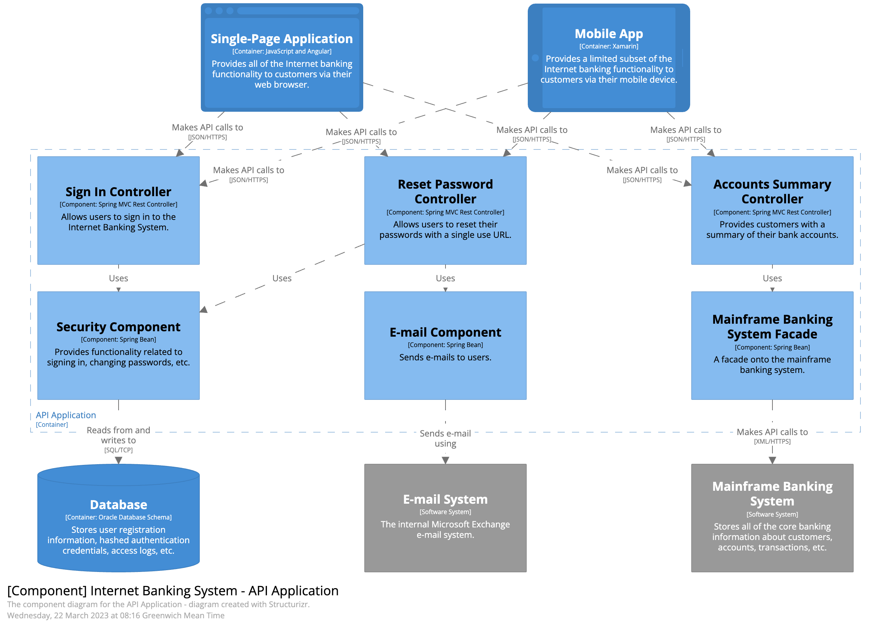

# C4 Model Diagram

Context, Container, Components, Code Diagram 4 단계로 나누어 작성하는 설계 방법, 단계가 내려갈 수록 추상화 단계가 낮아지며 구현 세부사항을 나타냄
필요한 상황에 맞추서 사용할 수 있고 배우기 쉬우며 빠르게 작성 가능하다.

## 구성

### Context

- C4 모멜 다이어그램의 가장 큰 단위
- 서비스를 이용하는 유저와 소프트웨어 시스템간의 관계, 역할등을 개략적으로 작성
- 개발자 이외의 인력들에게도 전체 흐름을 파악할 수 있도록 사용
- 기술적인 부분을 제외한 유저와 소프트웨어 시스템 상호작용을 중심으로 작성
- ex) 무언가의 시스템 

### Container   

- Context를 좀 더 구체화하고 별도로 실행 가능한 하나의 시스템 단위
- 유저가 서비스를 이용할 떄 어떤 프로세스로 시스템이 동작하는지 작성
- 주요 사용된 기술, 동작 방식을 이해할 수 있을 정도의 레벨로 작성
- 

### Component

- Container 내부의 주요 동작 구성요소들을 보여주는 단위
- 각 객체들의 역할과 상호작용에 대해 작성
- 사용된 기술과 설계 세부 사항을 보여 줄 수 있도록 작성
- ex) 클래스들

### Code

- 각 객체 내부의 클래스 메서드 인터페이스 등의 상호작용과 역할에 대해 작성
- 세부설계나 구현 내용이 복잡해 특별히 필요한 경우가 아닌 이상 작성이 권장되지는 않음

