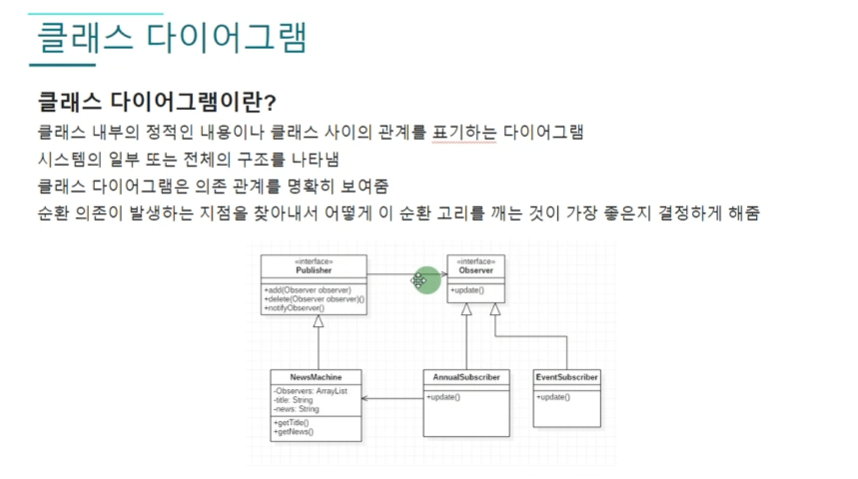
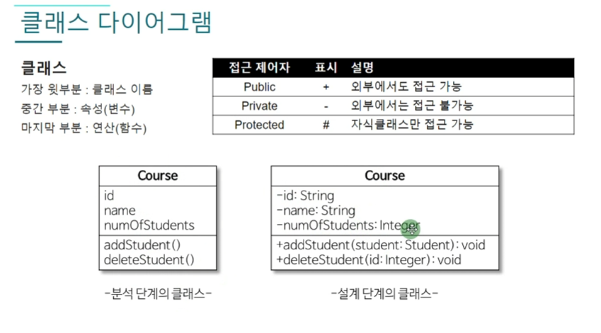
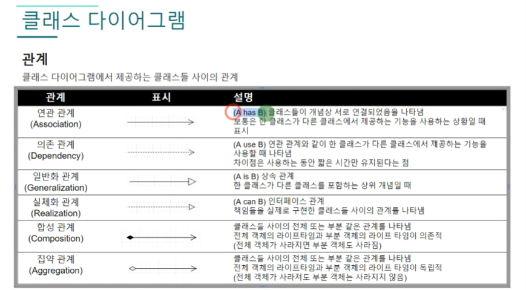
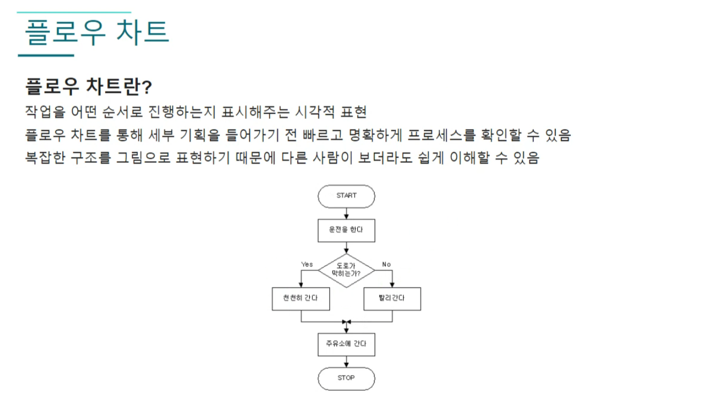
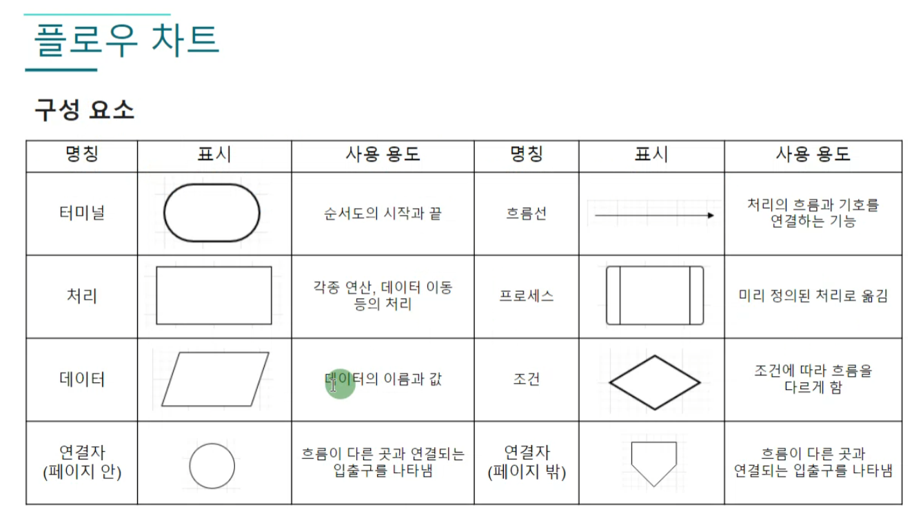
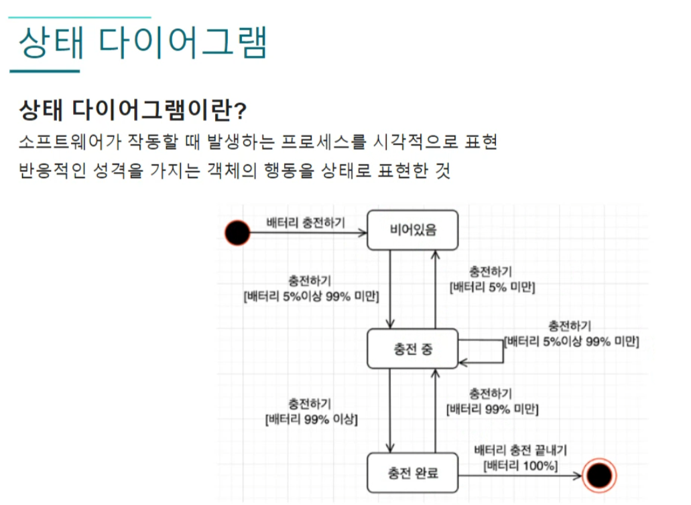

# 클래스 다이어그램



## 작성 규칙


+ 가상함수의 경우 기울기를 추가한 글자로 표현 할 수 도 있다.
+ 다양한 언어를 사용하는 프로젝트에서도 통일된 유용한 규칙이기 때문에 익혀둬야 함

## 관계


### 연관관계
(A has B) 클래스들이 개념상 서로 연결돠어 한 클래스가 다른 클레스에서 제공하는 기능을 사용하는 상황

### 의존 관계
(A use B) 연관 관계와 비슷하게 다른 클래스의 기능을 사용하지만 짧은 시간만 유지되는 매개변수로 쓰는 관계일때 사용

### 일반화 관계 
(A is B) 상속 관계, 즉 한 클래스가 다른 클래스를 포함하는 상위 개념일때 사용

### 실체화 관계
(A can B) 인터페이스 관계나 추상 클래스의 관계일때 사용

### 합성 관계와 집약관계
연관관계의 화살표와 비슷하지만 여러개를 가질때 합성과 집약의 관계를 가진다.
``` c#
private List<Item> items = new List<Item>();
pirvate Skill[] skills = new Skill[4];
```
합성관계는 클래스가 사라졌을 때 같이 사라지는 관계 (라이프타임 `의존적`)   
집약관계는 클래스가 사라지더라고 부분객체는 사라지지 않는 `독립적`인 관계

# 플로우 차트



하나의 기능을 만들때 알고리즘 구현에 도움이 될 수 있다.


## 구성요소




# 시퀀스 다이어그램

# 상태 다이어그램


