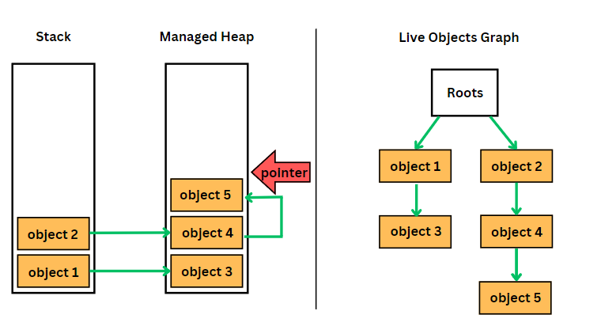

# 가비지 컬렉터(GC)

## 가비지 컬렉터란
스택 메모리는 사용할때마다 알아서 늘어나고 줄어들기 때문에 따로 신경쓸 필요가 없다. 그러나 힙 메모리는 메모리를 할당하면 해제하기 전까지 계속 그 메모리에 머물게 되어 쌓이게 되는데 가비지 컬렉터는 이러한 사용하지 않는 객체의 메모리를 자동으로 메모리 할당에서 해제해주는 역할을 한다. 즉 힙 영역에서 동적으로 할당했던 메모리 중 필요 없는 객체를 주기적으로 제거하는 프로세스이다.

## 가비지란
참조타입 변수들은 스택 메모리에 주소 값을 담아두고 힙 메모리에 접근한다. 함수가 종료되면 지역변수들이 제거되며 스택 메모리에서 힙 메모리를 가르키는 일부 주소값들이 사라지며 해당 힙 메모리의 데이터에는 더이상 접근 할 수 없게 된다. 이렇게 참조할 수 없게 된 객체를 가비지라고 한다.

## 가비지 컬렉터의 원리

C와 C++같은 언어에선 프로그래머가 직접 소멸자를 사용해 메모리 할당을 해제 해 주어야 했지만 C#이나 JAVA같은 언어에서는 가비지 컬렉터가 그 역할을 대신한다.
프로그램을 실행할 때 실행에 필요한 메모리를 요청하고 주소를 할당하는데 이 주소를 offset 주소라고 한다. 이 할당된 메모리들은 새롭게 선언되거나 형변환되며 다른곳을 가르키게 되고 그로인해 주소를 잃어버려 정리되지 못한 메모리로 남게된다.
가비지 컬렉터는 이러한 메모리들을 할당 해제시킨다.

### 가비지 컬렌션 과정
가비지 컬렉션은 Mark → Relocate → Compact 과정을 거친다.

1. Marking 단계는 사용되고 있는 객체를 연결하는 작업이다. 가비지 컬렉터는 처음에 모든 오브젝트를 가비지로 가정하고 루트 목록을 돌며 각 루트가 참조하는것을 마킹한다. 루트목록에서 시작된 연결 그래프를 만드는 작업이다.

2. Relocating 단계는 루트 목록에서 도달 할 수 없는 오브젝트들을 가비지로 간주하고 가비지가 차지한 공간을 비어있는 공간으로 간주한다.

3. Compacting 단계는 위의 단계가 끝나면 힙을 돌며 가비지가 차지했던 비어있는 공간에 인접한 도달할 수 있는 오브젝트들을 메모리 복사를 통해 덮어 씌우고 이러한 과정이 끝나면 포인터의 위치도 적절히 수정한다.

가비지 컬렉션 한 주기의 과정

compation을 수행하여 비어있는 공간의 오브젝트를 가져와 힙에 발생하는 메모리 단편화를 해결한다.

## 가비지 컬렉터의 단점
가비지 컬렉터의 단점은 직접 메모리 할당을 해제하는것과는 다르게 메모리가 언제 할당 해제되는지 정확히 알 수 없어 제어하기 힘들며, 가비지 컬렉션이 동작하는 동안 다른 동작을 멈추기 때문에 오버헤드가 발생하는데 이것을 STW(Stop The World) 라 한다.
