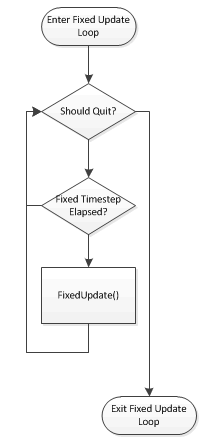
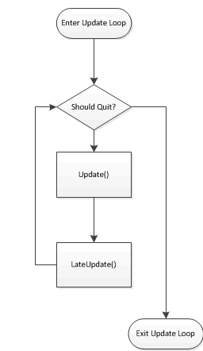
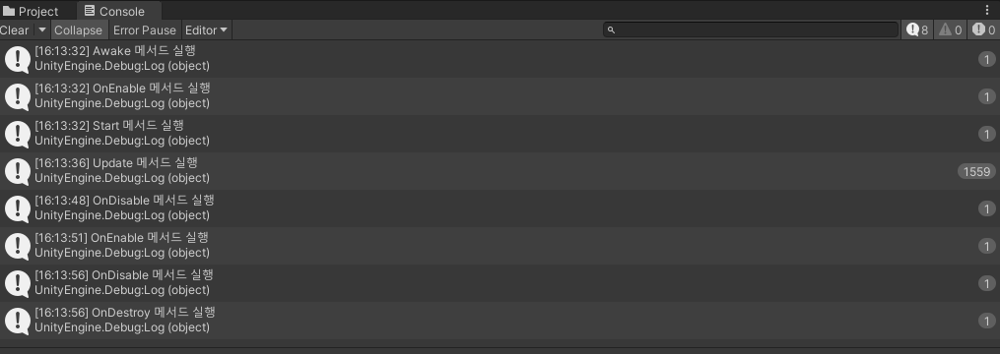
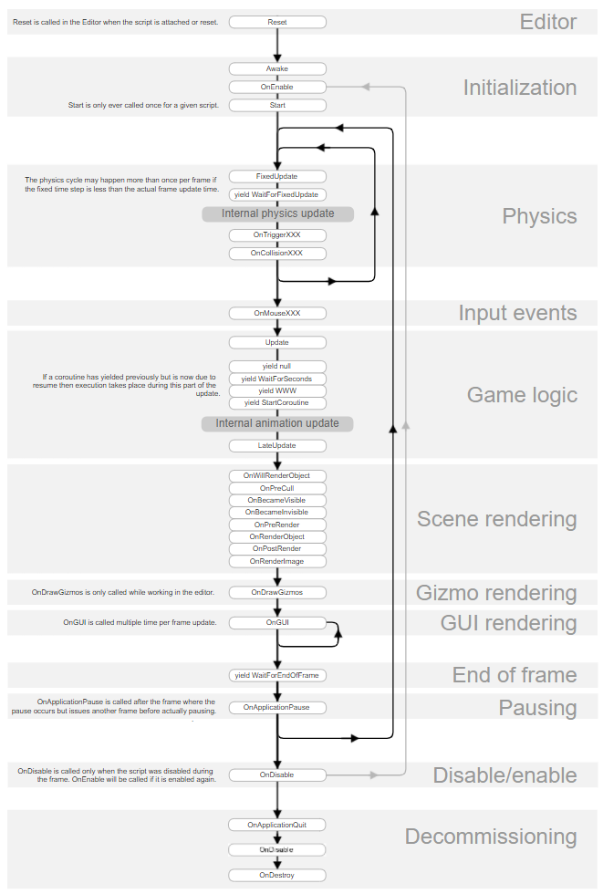

# 라이프 사이클

## 유니티 이벤트 함수 (메세지 함수)

- 유니티가 보내는 메세지에 반응하는 함수
- MonoBehaviour 클래스에 메세지와 같은 이름의 함수가 반응
- 스크립트는 유니티 엔진이 보내는 메세지를 받아 사건 타이밍을 확인
- 메세지 함수에서 자신의 행동을 정의하여 기능을 구성

### 1. Awake()
- 오브젝트 `생성`시 단 1회만 호출된다.
- 스크립트가 비활성화 되어있는 경우에도 호출된다.
- 역할 : 스크립트가 필요로 하는 초기화 작업 진행
  - Start보다 먼저 실행되며 외부 게임상황과 무관환 초기화 작업시 필요하다.
  - 스크립트가 비활성화 되더라도 Awake는 실행됨

### 2. Start()
- Awake() 이후 오브젝트의 `생성 및 활성화`시 단 1회만 호출된다.
- 스크립트가 비활성화 되어 있을경우 호출되지 않는다.
- 외부 게임상황이 필요한 초기화 작업시 필요하다.

#### Awake() 와 Start()의 차이점, 활용방안
- Awake()가 호출된 후 Start()가 호출됨.
- Awake()는 다른 컴포넌트에 대한 참조를 설정하기 위해 사용된다.
  - 스크립트 활성화 여부와 관계 없이 스크립트 개체가 초기화될때 호출된다.
  - 개체의 Awake()는 무작위 순서로 호출되기 때문에 Awake()에서 생성한 참조를 다른 개체의 Awake()에서 사용할 수 있다 보장 할 수 없다.
  - Start() 는 Awake()와 Update() 사이에 호출된다
    - 스크립트가 비활성 상태라면 Awake()만 호출된다
  - Awake()를 사용해 객체와 참조 및 변수를 초기화 한 후 Start()는 앞서 Awake()로 초기화한 참조를 사용한다.
    - 이렇게 사용하면 아직 초기화되지 않은 참조를 사용하는 상황을 배제할 수 있어 null 참조 오류를 피할 수 있다.

### 3. OnEnable()
- 오브젝트의 `활성화`시마다 1회 호출되며, Update() 이전에 호출된다.
- 스크립트가 활성화 되었을 때 작업을 진행


### 4. OnDisable()
- 오브젝트의 `비활성화`시마다 1회 호출되며, Update() 이후에 호출된다.
- 안쓸때마다 1회씩 계속 호출되는것이 OnDestroy와는 다른점
- 스크립트가 비활성화 되었을때 작업 진행

### 5. Update()
- 매 `프레임`마다 1회 호출되며, 오브젝트와 스크립트의 생존 및 활성화 시에만 동작한다.
- 프레임마다 전체 시스템에서 수행되는 작업의 양이 다르므로, 호출되는 주기가 일정하지 않다.
  - 현재프레임과 이번 프레임 사이의 시간을 반환하는 Time.deltaTime을 출력시 매 프레임 사이의 시간이 일정하지 않다는 것을 확인 가능
- 핵심 게임 로직 구현에 사용됨

### 6. FixedUpdate()
- 함수 `호출간격이 일정`한 Update 메서드의 역할을 한다.
- 일정한 주기로 같은 연산을 처리해야하는 작업에 활용됨
- 물리계산 및 Ray 처리에 사용할 수 있으며 Rigidbody 컴포넌트를 다룰때 사용하면 더 정확한 물리 계산이 가능하다.
  - Ray : 시작점(Vector3 타입)과 방향(법선 벡터)을 가지는 구조체
- Fixed Timestep 이라는 정해진 주기(변경 가능)마다 호출됨

### 7. LateUpdate()
- 모든 `Update가 끝난 후` 프레임당 한번 호출되는 함수
- 오브젝트를 추적하는 카메라에 주로 사용됨
  - EX) 플레이어의 움직임을 Update에서 처리, 이동한 위치에 따라 카메라의 위치를 LateUpdate에서 처리함
  
#### FixedUpdate(), Update(), LateUpdate()의 차이점



- Update는 매 프레임마다 호출됨. 호출 주기가 일정하지 않음.
- FixedUpdate는 정해진 Fixed Timestep 주기마다 호출됨
- LateUpdate는 모든 Update가 끝난 뒤에 호출됨

### 8. Coroutine
- 연산 수행시 Update() 이후에 수행하지만 실행과 정지를 사용자가 자유롭게 사용할 수 있는 서브루틴이다.

### 9. OnDestroy()
- 오브젝트의 `파괴` 시 1회 호출된다.
- 스크립트가 씬에서 삭제되었을때 실행
- 스크립트가 필요로 하는 마무리 작업 진행

### 이벤트 함수의 실행 순서 





<br>

[유니티 이벤트함수 실행 순서 ](https://docs.unity3d.com/kr/2021.3/Manual/ExecutionOrder.html)


## 데이터 직렬화
- 오브젝트의 멤버변수 값을 확인하거나 변경
- 오브젝트의 멤버변수 참조를 드래그 앤 드랍 방식으로 연결

### 지원되는 데이터 타입
```c#
// c# 타입
public bool boolType;
public int intType;
public float floatType;
public string stringType;

// Unity 타입
public Vector2 vector2;
public Vector3 vector3;

// 소수점 불가능한 벡터값
public Vector2Int intVector2;
public Vector3Int intVector3;

public Color color;

public Rect rect;
public LayerMask layerMask;
public AnimationCurve curve;
public Gradient gradient;

// 열거형
public enum JobType { Warrior, Mage, Baba}
public JobType jobType;

//배열 기반 자료구조
public int[] array;
public List<int> list;

public Rigidbody rigid;
public Collider coll;

```

### 어트리뷰트
클래스, 속성 또는 함수위에 명시해 특별한 동작을 나타 낼 수 있는 마커
```c#
// 어트리뷰트

[Space(30)] // 여백을 추가

[Header("InputHeader")] // 헤더를 추가 , 밑에 변수가 없으면 오류

[SerializeField] private int privateValue; //private지만 인스펙터에서 조작하고싶은경우

[HideInInspector] public int publicValue; //public이지만 인스펙터에서 조작을 막고싶은경우

[Range(3, 5)]
public float percent; // 범위를 지정해주고 싶은 경우 인스펙터에서 슬라이더로 표현됨

[TextArea(3,5)]
public string story; //최소 줄 수와 최대 줄 수를 지정해 긴 문자열을 인스펙터에서 입력 가능

//원래 구조체와 클래스는 인스펙터상에서 수정 불가능, Serializable로 가능하게 만들 수 있다.
[System.Serializable]
public struct Data 
{
    public string name;
    public int level;
    public float rate;
}
public Data data;
```
